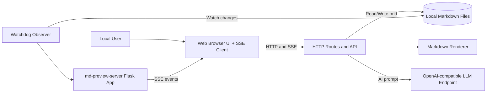
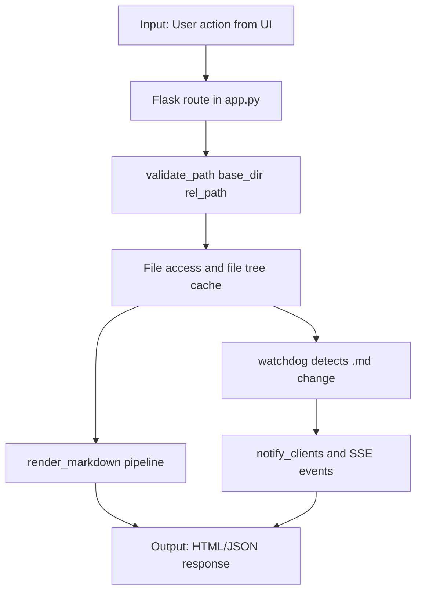
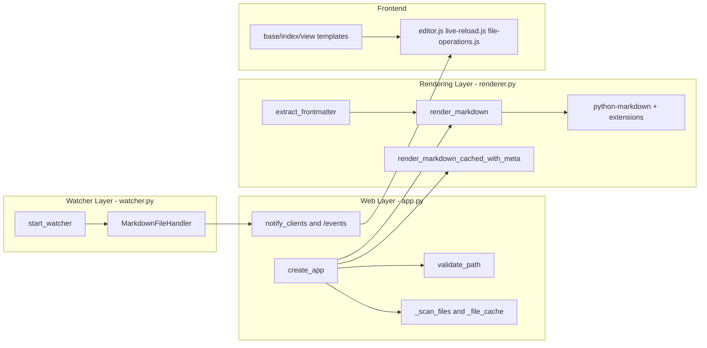

## 1. Executive Summary

md-preview-server is a local Flask application that serves, previews, edits, and manages Markdown files from a selected base directory. It combines server-side markdown rendering with a browser UI that supports live reload, in-browser editing, search, file operations, and HTML export. The backend organizes features around route phases in `app.py` and uses a watchdog observer plus Server-Sent Events (SSE) to notify connected clients when files change. The rendering pipeline supports syntax highlighting, table-of-contents generation, YAML frontmatter extraction, Mermaid, and math extensions. The app also includes an optional AI assistant route that calls an OpenAI-compatible endpoint configured through environment variables.

## 2. Architecture Overview



The system is a single-process Flask web service with a static frontend and template-rendered pages:

- Core web app: `src/md_preview_server/app.py`
- Markdown rendering module: `src/md_preview_server/renderer.py`
- File watcher module: `src/md_preview_server/watcher.py`
- Frontend assets: `src/md_preview_server/static/`
- HTML templates: `src/md_preview_server/templates/`

### Context (C4 Level 1)

- Primary actor: local user in browser.
- System under documentation: md-preview-server Flask app.
- External dependency: local filesystem (base directory with `.md` files).
- Optional external dependency: OpenAI-compatible LLM endpoint (`/api/ai/ask`).

### Communication Channels

- Browser -> Flask: HTTP routes and JSON REST APIs.
- Flask -> Browser: SSE stream via `/events`.
- Watchdog -> Flask: callback into `notify_clients()` on `.md` changes.
- Flask -> Filesystem: read/write/create/rename/delete markdown files.

## 3. Processing Pipeline



The runtime flow is:

1. User triggers action from the UI (open file, edit, search, upload, export).
2. Flask route in `create_app()` receives request (`/view/*` or `/api/*`).
3. Path safety guard validates file scope with `validate_path(base_dir, rel_path)`.
4. Route accesses file tree/list through `_scan_files()` and related helpers.
5. Renderer converts markdown to HTML using `render_markdown_*` functions.
6. Watchdog detects filesystem changes and pushes SSE notifications.
7. Browser refreshes document view/tree and updates UI state.

### Caching Model

- File cache (`_file_cache` in `app.py`): stores directory tree and flat file metadata list; invalidated when change notifications fire.
- Render cache (`_render_cache` in `renderer.py`): OrderedDict cache keyed by `(filepath, mtime_ns, size)` to avoid stale same-mtime writes.

## 4. Core Components



### Component Table

| Functional Area | Module | Key Elements | Responsibility |
| --- | --- | --- | --- |
| Web/API layer | `app.py` | `create_app`, route handlers | Route registration, request validation, response formatting |
| Path security | `app.py` | `validate_path` | Prevent path traversal by enforcing resolved path under base directory |
| File indexing | `app.py` | `_iter_markdown_files`, `_scan_files` | Build tree/list metadata for sidebar and APIs |
| SSE hub | `app.py` | `_subscribers`, `/events`, `notify_clients` | Push live change events to connected browser clients |
| Renderer | `renderer.py` | `render_markdown`, `render_markdown_cached_with_meta` | Convert Markdown to HTML, parse frontmatter metadata, cache results |
| Watcher | `watcher.py` | `MarkdownFileHandler`, `start_watcher` | Detect filesystem changes and debounce event storms |
| Frontend shell | templates + JS | `base.html`, `view.html`, `editor.js` | Navigation, editing, preview updates, file operations |
| Optional AI bridge | `app.py` + `ai-assistant.js` | `/api/ai/ask` | Send prompt + current doc content to OpenAI-compatible backend |

### Design and Cross-Cutting Patterns

- App factory pattern: `create_app(base_dir)` configures state and routes.
- Event-driven update loop: watchdog callback + SSE fan-out.
- Cache invalidation on mutation: tree/list cache reset whenever file state changes.
- Defense in depth for paths: route-level use of `validate_path` before filesystem operations.
- Route-phase organization: API endpoints grouped by functional phases (listing, mutate, picker, editor, export).

## 5. API Contracts and Message Schemas

### Public Page Routes

| Method | Path | Description |
| --- | --- | --- |
| GET | `/` | Index page with file tree |
| GET | `/view/<path:filepath>` | Render a selected markdown file |
| GET | `/events` | SSE stream for live reload |

### Core JSON APIs

| Method | Path | Purpose |
| --- | --- | --- |
| GET | `/api/files` | Return tree, flat file list, and base directory |
| GET | `/api/search?q=` | Search file name/path |
| GET | `/api/search/content?q=` | Full-text content search with snippet results |
| POST | `/api/upload` | Upload `.md` files |
| POST | `/api/create` | Create markdown file |
| PUT | `/api/rename` | Rename/move markdown file |
| DELETE | `/api/delete` | Delete one or more files (requires confirm) |
| GET | `/api/directories` | Browse candidate base directories |
| POST | `/api/set-base-directory` | Switch watched base directory |
| GET | `/api/content/<path>` | Fetch raw markdown content for editor |
| PUT | `/api/save` | Save markdown content with conflict detection |
| POST | `/api/preview` | Render live markdown preview |
| POST | `/api/ai/ask` | Ask AI assistant with document context |
| GET | `/api/export/html/<path>` | Download standalone HTML export |

### Selected Request/Response Shapes

#### `POST /api/create`

Request body:

| Field | Type | Required | Notes |
| --- | --- | --- | --- |
| path | string | yes | `.md` extension auto-appended if omitted |
| content | string | no | initial file contents |

Response body:

| Field | Type | Notes |
| --- | --- | --- |
| success | boolean | `true` on create |
| path | string | normalized created path |
| error | string | present on error |

#### `PUT /api/save`

Request body:

| Field | Type | Required | Notes |
| --- | --- | --- | --- |
| path | string | yes | relative markdown path |
| content | string | yes | new document content |
| last_modified | string | no | ISO timestamp for optimistic conflict check |

Response body:

| Field | Type | Notes |
| --- | --- | --- |
| success | boolean | save status |
| modified | string | updated server modified timestamp |
| error | string | includes `conflict` for stale writes |
| server_modified | string | returned on conflict |
| server_content | string | returned on conflict |

#### `GET /api/files`

Response body:

| Field | Type | Notes |
| --- | --- | --- |
| tree | object | nested directory/file structure |
| files | array | flat list with metadata |
| base_dir | string | absolute active base directory |

File item schema:

| Field | Type | Notes |
| --- | --- | --- |
| path | string | relative path |
| name | string | file name |
| size | number | byte size |
| modified | string | ISO-8601 timestamp |

## 6. Infrastructure and Deployment

### Runtime Model

- Execution type: local process, single Flask app (`md-preview` script entrypoint).
- Default bind: `127.0.0.1:8000`.
- Concurrency mode: Flask threaded server (`threaded=True`).
- Filesystem watcher: watchdog observer daemon thread.

### Build and Packaging

- Package/build system: `hatchling`.
- Dependency manager: `uv` (project guidance explicitly uses uv, not direct pip workflow).
- Script entrypoint from `pyproject.toml`:
  - `md-preview = "md_preview_server.app:main"`

### CI/CD and Containers

- No Dockerfile or container orchestration manifests detected.
- No CI workflow files detected in `.github/workflows/`.

### Environment Variables

Used by AI assistant endpoint:

| Variable | Default | Purpose |
| --- | --- | --- |
| OPENAI_API_KEY | `local-key` | API auth key for OpenAI-compatible backend |
| LLM_BASE_URL | `http://localhost:1234/v1` | Chat completion base URL |
| LLM_MODEL | `local-model` | Model identifier |

## 7. Extension Patterns

### Add a New API Endpoint

1. Add a route in `create_app()` in `src/md_preview_server/app.py`.
2. Apply `validate_path()` for any user-provided path before file operations.
3. Use `notify_tree_changed()` for create/delete/rename semantics.
4. Use `notify_clients(changed_path)` when content updates should refresh open views.
5. Add tests in `tests/` for success, validation, and path traversal cases.

### Add a Renderer Capability

1. Update `_EXTENSIONS` or `_EXTENSION_CONFIGS` in `src/md_preview_server/renderer.py`.
2. Keep rendering deterministic and side-effect free.
3. Verify cache behavior in tests similar to `test_cached_render_refreshes_when_size_changes_with_same_mtime`.

### Extend Frontend Features

1. Update templates in `src/md_preview_server/templates/`.
2. Add behavior in focused JS modules under `src/md_preview_server/static/js/`.
3. Keep API contract compatibility with backend JSON shape.
4. Ensure live updates still propagate through `/events` listener logic.

## 8. Rules and Anti-Patterns

### Rules (from repository guidance and implementation)

- Use `uv` for dependency installation and lockfile updates.
- Treat all user path inputs as untrusted and validate against base directory.
- Restrict write operations to markdown files (`.md`) for create/upload flows.
- Invalidate caches whenever file tree/content mutates.

### Anti-Patterns to Avoid

- Bypassing `validate_path()` for any filesystem route.
- Adding synchronous heavy work inside SSE stream loops.
- Using file modification time alone as a render cache key.
- Importing optional heavy dependencies globally at startup when only needed in specific routes.

## 9. Dependencies

### Runtime Dependencies (`pyproject.toml`)

| Package | Version Spec | Role |
| --- | --- | --- |
| flask | `>=3.0` | HTTP server and routing |
| markdown | `>=3.5` | Markdown parser |
| pymdown-extensions | `>=10.0` | Extended markdown features (including math support) |
| pyyaml | `>=6.0` | YAML frontmatter parsing |
| pygments | `>=2.17` | Code syntax highlighting |
| watchdog | `>=4.0` | Filesystem watch events |
| openai | `>=1.0.0` | Optional AI assistant API client |

### Development Dependencies

| Package | Version Spec | Role |
| --- | --- | --- |
| pytest | `>=7.0` | Test runner |

## 10. Code Structure

Annotated tree (2-3 levels):

```text
py-MD-viewer/
|- src/
|  |- md_preview_server/
|     |- app.py                # Flask app factory, route phases, SSE, startup
|     |- renderer.py           # Markdown rendering, frontmatter parsing, render cache
|     |- watcher.py            # Watchdog event handling with debounce
|     |- templates/
|     |  |- base.html          # Layout shell and modals
|     |  |- index.html         # File browser landing page
|     |  |- view.html          # Viewer/editor page with metadata and AI panel
|     |- static/
|        |- css/               # Theme + markdown styles
|        |- js/                # Navigation, editor, live reload, file ops, AI assistant
|- tests/
|  |- test_app.py              # Core page routes and safety checks
|  |- test_api.py              # File, mutation, directory APIs
|  |- test_editor.py           # Content/save/preview editor API
|  |- test_export.py           # Standalone HTML export behavior
|  |- test_renderer.py         # Rendering and cache behavior
|  |- test_startup.py          # Startup import behavior
|- examples/                   # Sample markdown content for manual exploration
|- pyproject.toml              # Project metadata, dependencies, script entrypoint
|- README.md                   # Setup and usage
|- CLAUDE.md                   # Repo-specific engineering guidance
```
